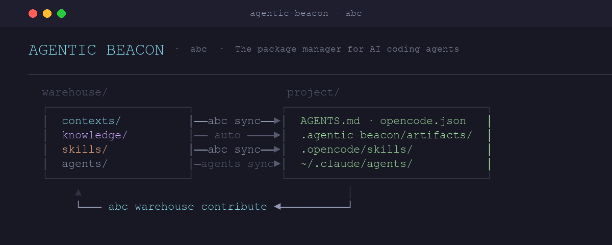
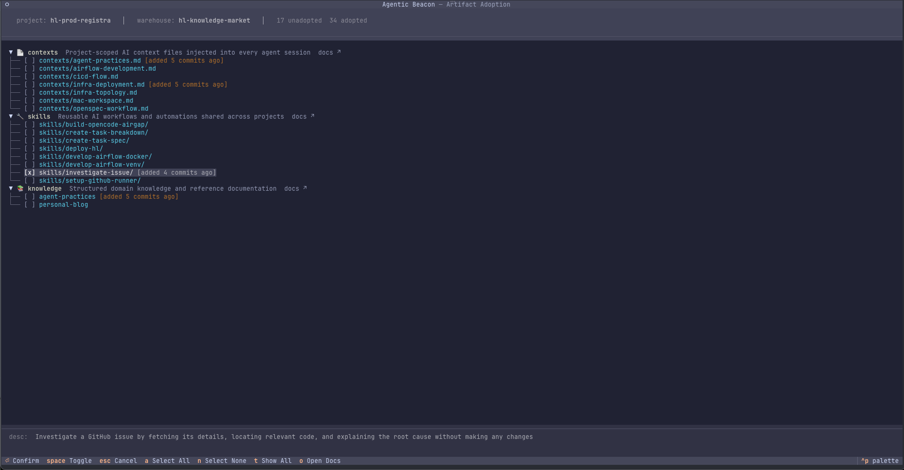

<p align="center">
  
</p>

<p align="center">
  <a href="https://github.com/Shadowsong27/agentic-beacon/blob/main/LICENSE"></a>
  <a href="https://pypi.org/project/agentic-beacon/"></a>
  <a href="https://github.com/Shadowsong27/agentic-beacon/stargazers"></a>
  <a href="https://github.com/Shadowsong27/agentic-beacon/pulls"></a>
</p>

**The package manager for AI coding agents. Centrally manage and distribute contexts, knowledge, and skills across your team — with native support for Claude Code and OpenCode.**

> *Git for AI Prompts. DRY for AI Agents.*

Agentic Beacon provides:
1. 🗂️ **A methodology** for managing contexts, knowledge, and skills — the core agentic engineering artifacts worthy of standardization and team-wide distribution
2. 🛠️ **CLI tooling (`abc`)** for initializing warehouses, managing connections, and distributing artifacts across projects

> **Built for multiplayer.** Agentic Beacon is designed as a team tool first. The warehouse model is built around shared ownership, bidirectional contribution, and the compounding benefits of a growing knowledge base — value that scales with the number of people and projects contributing to it. Solo use is fully supported (many start that way), but the tool was built with multiplayer in mind.

## The Problem

When a team adopts AI coding agents, each project accumulates its own `AGENTS.md` or `.cursorrules`. Standards diverge. A pattern discovered in one repo never reaches the others. When guidelines change, someone copy-pastes updates into 15 repos and misses three.

This is **Context Drift** — the same DRY problem that version control solved for code, except it hasn't been solved yet for agentic engineering artifacts.

- **Reinvention at every project.** Context files get written from scratch for each new repo, with variations that accumulate over time.
- **Knowledge stays siloed.** Lessons learned in one project never leave that developer's laptop.
- **No feedback loop.** When an agent session produces a better approach, there's no workflow to share it.

## How It Works

There are two moving parts:

**Warehouse** — a single git repository owned by your team. It holds the shared source of truth: contexts, knowledge, skills, and agent definitions. Cloned locally on every developer's machine; commit it like any other repo.

**Beacon** — a per-project connector. Running `abc warehouse connect` creates `.agentic-beacon/` in your project with a `beacon.yaml` that declares which warehouse artifacts this project needs.

```
Warehouse clone (local git repo)              Your project / global
────────────────────────────                  ────────────────────────────────
knowledge/   ── abc sync (symlink) ──►  .agentic-beacon/artifacts/knowledge/
contexts/    ── abc sync (symlink) ──►  .agentic-beacon/artifacts/contexts/
                                        opencode.json / AGENTS.md (wired)
skills/      ── abc sync (symlink) ──►  .agentic-beacon/artifacts/skills/
                                        .opencode/skills/<name>/  (wired)
                                        .claude/skills/<name>/    (wired)
agents/      ── abc agents sync  ───►   ~/.claude/agents/<name>.md       (copied, outside warehouse)
                                        ~/.config/opencode/agents/<name>.md
```

`abc sync` reads `beacon.yaml` and creates per-file **symlinks** from `.agentic-beacon/artifacts/` into your local warehouse clone, then wires skills into each detected tool's live directories. One logical artifact, one physical file per machine — no duplicate copies, no merge-back cycle. Agents, which live outside the warehouse tree in machine-wide tool directories, are still installed as copies via `abc agents sync`.

When a session produces something worth sharing, you edit the file in place — the edit lands directly in the warehouse working tree through the symlink — and commit it with `abc warehouse contribute -m "…"`. Teammates pull the warehouse and the new content is visible through their existing project symlinks with no per-project resync.

> **Read:** [Decision — Single Warehouse Write Entrypoint](./knowledge/decisions/single-warehouse-write-entrypoint.md) for why the model works this way.

> **Platform support:** macOS and Linux only. Windows is not supported by `abc sync`.

> See **[Getting Started](./guides/getting-started.md)** for a full walkthrough with examples.

## Artifact Types

Four types form the core of a warehouse, each defined by two axes: **project scope** and **tool specificity**:

|  | Tool-agnostic | Tool-specific |
|---|---|---|
| **Project-scoped** | 📄 Contexts · 🧠 Knowledge | ⚡ Skills |
| **Global** | — | 🤖 Agents |

- **Contexts** — boot instructions and coding standards; wired into `opencode.json` / `AGENTS.md` automatically on sync.
- **Knowledge** — atomic decisions, lessons, and facts; symlinked under `.agentic-beacon/artifacts/` and referenced from contexts.
- **Skills** — reusable workflows wired as slash commands into each tool's live directories.
- **Agents** — sub-agent definitions installed once (as copies, since they live outside the warehouse tree) into global tool directories (`~/.claude/agents/`, `~/.config/opencode/agents/`) and available across every project.

> See **[Artifact Type Matrix](./docs/artifact-type-matrix.md)** for the full design rationale and how this drives command behaviour.

## Interactive Artifact Adoption

`abc adopt` opens an interactive TUI to browse and select warehouse artifacts. Scroll through contexts, skills, and knowledge nodes — press `Space` to select, `Enter` to confirm.

<p align="center">
  
</p>

**Keyboard shortcuts:**

| Key | Action |
|-----|--------|
| `Space` | Toggle selection |
| `Enter` | Confirm and write to beacon.yaml |
| `a` / `n` | Select all / Select none |
| `t` | Toggle show-all (view already-adopted artifacts) |
| `Esc` / `q` | Cancel |

## Quickstart

### Installation

```bash
# Recommended — install once, use anywhere
uv tool install agentic-beacon

# Alternatives: pipx install agentic-beacon  |  pip install agentic-beacon
# Offline / air-gapped: download a platform bundle from the GitHub Releases page
```

### Get Started

**Starting fresh (no warehouse exists yet)**

```bash
# 1. Create your team warehouse
abc warehouse init my-org-warehouse
cd my-org-warehouse
# add contexts, knowledge, skills — then push to git

# 2. Connect a project (warehouse must be a local clone)
cd ~/my-project
abc warehouse connect --path ~/my-org-warehouse

# 3. Adopt artifacts interactively, then sync
abc adopt            # browse + select artifacts via TUI, writes beacon.yaml
abc sync             # creates symlinks into the warehouse clone, wires agent config
```

**Joining a team that already has a warehouse**

```bash
git clone git@github.com:your-org/warehouse.git ~/my-org-warehouse

cd ~/my-project
abc warehouse connect --path ~/my-org-warehouse
abc adopt
abc sync
```

### Day-to-day Workflow

```
1. code with agent                          — agent uses the symlinked contexts, knowledge, and skills
2. abc warehouse status                     — see warehouse edits you've made (scoped by beacon.yaml)
3. abc warehouse contribute -m "…" --push   — commit and push the edits in the warehouse
4. teammates git pull                       — updated content visible through their existing symlinks immediately
```

`abc sync` is only needed again when your `beacon.yaml` changes (new artifacts declared) or when symlinks drift (missing/broken targets) — not per warehouse update.

## Agentic Beacon vs. Similar Tools

| Tool | What it does |
|------|-------------|
| **Repomix** | Bundles your codebase into a single LLM-readable file |
| **faf-mcp** | Syncs context files locally via MCP |
| **cursorrules.com** | Static directory of community `.cursorrules` files |
| **Shared wiki / prompt library** | A team-maintained document store agents are told to read |
| **Langfuse / LLM Ops tools** | Production observability and prompt management for LLM apps |

**Use Agentic Beacon when** you want a version-controlled, team-wide source of truth for agent instructions across multiple projects or repos.

**Not the right fit when** you need a one-off codebase bundle (use Repomix), a single solo project, or production LLM observability (use Langfuse).

### Why not a shared wiki or prompt library?

A shared wiki is **read-only by design** — someone curates it, everyone else consumes it. There is no path from a coding session back to the wiki. Improvements stay on the developer's machine.

Agentic Beacon is **bidirectional**. When an agent session produces a better approach, `abc warehouse contribute` commits the edit back into the warehouse clone (the same clone your project's symlinks point at, so the edit already landed there the moment it was saved). Once the commit is pushed, every other project on your team's machines gets the improvement automatically — no per-project resync. The warehouse gets smarter over time because the whole team is contributing to it, not just reading from it. That compounding loop is what the tool was built around.

## Documentation

### Conceptual Design (docs/)
- **[Artifact Type Matrix](./docs/artifact-type-matrix.md)** — Scope and tool-specificity axes; how they drive command design
- **[Agentic Warehouse Design](./docs/agentic-warehouse-design.md)** — High-level design and architecture
- **[Boot Context Design](./docs/boot-context-design/)** — AGENTS.md architecture and patterns
- **[Spec-Driven Development](./docs/spec-driven-development.md)** — Structured approach to feature planning

### Practical Guides (guides/)
- **[Getting Started](./guides/getting-started.md)** — Full onboarding walkthrough
- **[Warehouse Creation](./guides/warehouse-creation.md)** — Creating and structuring a warehouse
- **[Contributing Back](./guides/warehouse-contribution-guide.md)** — Commit agent improvements back to the warehouse
- **[beacon.yaml Reference](./guides/beacon-yaml-reference.md)** — Full configuration schema
- **[Team Collaboration](./guides/team-collaboration.md)** — Multi-team workflows
- **[Advanced Patterns](./guides/advanced-patterns.md)** — Glob patterns, dry-run, warehouse commands, migration

### Examples (examples/)
- **[Sample Warehouse](./examples/sample-warehouse/)** — Mirror of the public starter warehouse

## CLI Reference

| Command | Description |
|---------|-------------|
| `abc warehouse init <dir>` | Initialize a new warehouse repository |
| `abc warehouse connect --path <path>` | Connect a project to a local warehouse clone |
| `abc warehouse status [<path>] [--all]` | Show uncommitted warehouse edits (scoped by `beacon.yaml` unless `--all`) |
| `abc warehouse contribute -m "…" [--push]` | Commit warehouse edits, optionally push |
| `abc warehouse list` | List artifacts available in the connected warehouse |
| `abc warehouse template-upgrade` | Upgrade template-generated files in an existing warehouse |
| `abc adopt` | Interactively browse and select warehouse artifacts via TUI; writes to `beacon.yaml` |
| `abc sync` | Create/repair symlinks for all artifacts declared in `beacon.yaml`; wires agent config |
| `abc sync --dry-run` | Preview the symlink operations without touching the filesystem |
| `abc sync --contribute-local` / `--discard-local` | Non-interactive migration from a copy-based tree |
| `abc doctor` | Validate project health: warehouse connection, `beacon.yaml` validity, broken symlinks |
| `abc agents sync` | Install agent definitions from warehouse into global tool directories (`--force` / `--preserve`) |
| `abc reset` | Force-rebuild all symlinks from the warehouse |
| `abc list` | List synced artifacts; `abc list agents` shows globally installed agents |
| `abc status` | Show current warehouse connection and project sync status |
| `abc clean` | Remove synced artifacts from the project |

**Platform support:** macOS and Linux only.

---

If you find Agentic Beacon useful, consider [giving it a star](https://github.com/Shadowsong27/agentic-beacon) — it helps others discover the project.

**Last Updated:** 2026-05-03
